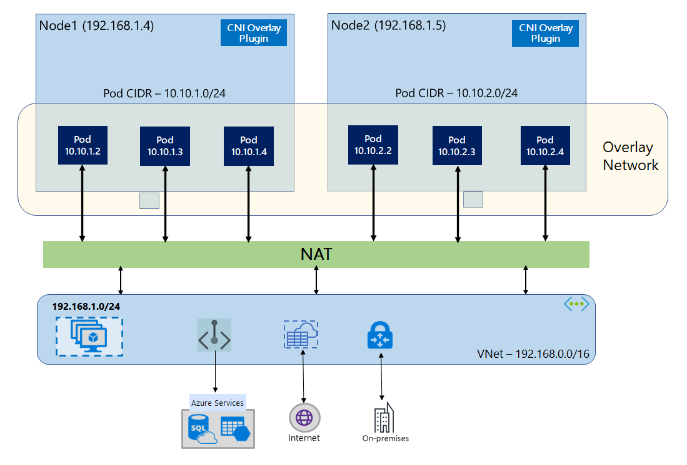

# Terraform AKS Cluster with Multiple Node Pools

 
This Terraform code provisions an AKS cluster with multiple node pools and configures its network profile, default node pool, and node pools for analyzer, clickhouse, and cs. It also provisions a virtual network with multiple subnets.

## Usage

To use this Terraform code:

1. Install Terraform on your machine.
2. Clone this repository.
3. Navigate to the cloned directory.
4. `az login` 
5. `az extension add --name aks-preview && az extension update --name aks-preview && az feature register --namespace "Microsoft.ContainerService" --name "AzureOverlayPreview" && az provider register --namespace Microsoft.ContainerService`
6. Run `terraform init` to initialize the Terraform configuration.
7. Run `terraform plan` to see the infrastructure plan.
8. Run `terraform apply` to apply the infrastructure changes.

## AKS Cluster

The AKS cluster is created with the provided parameters, such as the name, location, and Kubernetes version. The network profile is configured to use Azure CNI as the network plugin with the Overlay mode and Cilium as the eBPF dataplane. A pod CIDR of 192.168.0.0/16 is also configured.

The default node pool is created with the provided parameters, such as the name, minimum and maximum count of nodes, VM size, and tags. It is configured to use the core subnet.

Three additional node pools are also created, one for the analyzer, one for ClickHouse, and one for CS, with similar configurations to the default node pool.

## Virtual Network

Finally, a virtual network with five subnets is created, named core, ep, nat, public, and site, with the provided CIDR blocks.

Note that the commented-out code for the container registry is not used in this configuration.

# Kubernetes Networking: Kubenet vs Azure CNI Overlay

## Overview

Kubernetes networking is a critical aspect of managing a cluster. In this README, we compare two common Kubernetes networking solutions: Kubenet and Azure CNI Overlay.

## Kubenet

Kubenet is a basic networking solution that is included with Kubernetes by default. It assigns IP addresses to pods from an address space logically different from the VNet. However, Kubenet has some limitations when it comes to scalability. Specifically, it can support up to 400 nodes and 250 pods per node.

### Pros
- Simple to set up, no additional configuration is required for pod networking.
- Kubenet is a built-in solution in Kubernetes.

### Cons
- Limited scalability.
- Complex networking configuration is required to set up Kubernetes Network Policies.

## Azure CNI Overlay

Azure CNI Overlay is a more advanced networking solution that provides more flexibility and scalability. It assigns IP addresses to pods from the VNet address space, which eliminates the need for additional routing tables. Azure CNI Overlay can support up to 1000 nodes and 250 pods per node.

### Pros
- Higher scalability.
- Performance on par with VMs in a VNet.
- Supports Azure Network Policies, Calico, and Cilium.

### Cons
- Additional hop adds minor latency compared to Kubenet.
- Only Linux is supported.

## Comparison Table

| Area                      | Azure CNI Overlay                                               | Kubenet                                                        |
|---------------------------|-----------------------------------------------------------------|----------------------------------------------------------------|
| Cluster scale             | 1000 nodes and 250 pods/node                                    | 400 nodes and 250 pods/node                                    |
| Network configuration      | Simple - no additional configuration required for pod networking | Complex - requires route tables and UDRs on cluster subnet for pod networking |
| Pod connectivity performance | Performance on par with VMs in a VNet                          | Additional hop adds minor latency                             |
| Kubernetes Network Policies | Azure Network Policies, Calico, Cilium                          | Calico                                                         |
| OS platforms supported     | Linux and Windows Server 2022                                   | Linux only                                                     |

## Conclusion

Both Kubenet and Azure CNI Overlay have their advantages and disadvantages. If you need a simple, basic solution for a small cluster, Kubenet may be the way to go. However, if you need a more advanced and scalable networking solution with more features, Azure CNI Overlay is the better choice.

For more information on Kubernetes networking, see the [official documentation](https://kubernetes.io/docs/concepts/cluster-administration/networking/).

## Running with HA architecture
